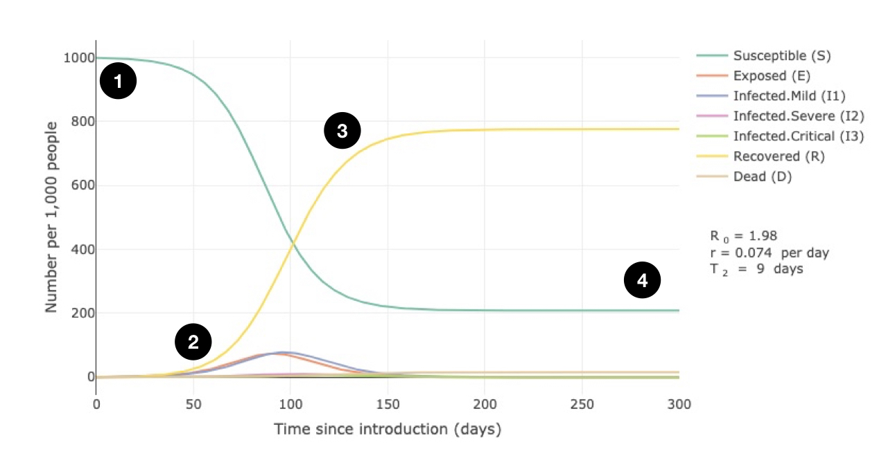
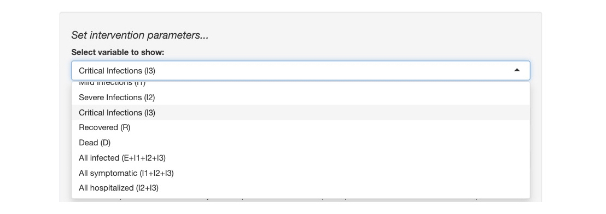
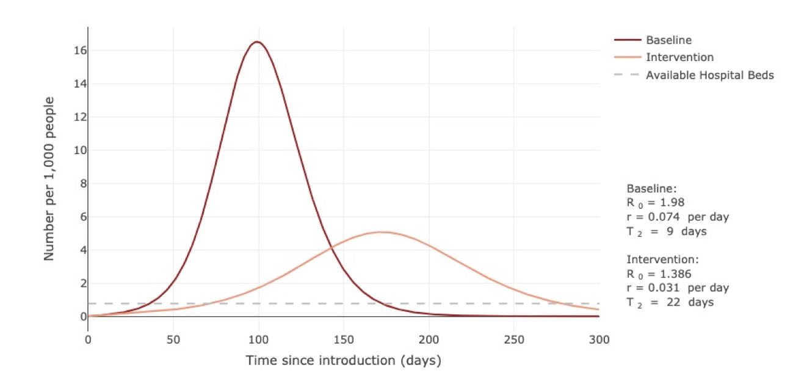
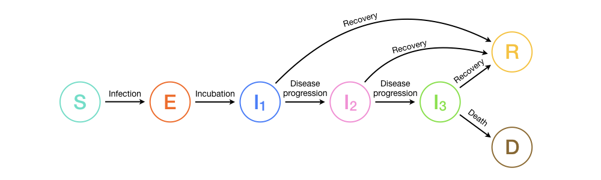

### Getting started on the COVID-19 Shiny app
 

#### Simulating COVID-19 spread

This app uses a mathematical model to describe how COVID-19 spreads in a population of individuals who have never been exposed to the disease previously. The speed and extent to which the disease spreads - and how much it may ultimately overwhelm healthcare capacity - will depend on a number of rates related to disease transmission and progression, which we can specify using the sliders on the left (more on these below). There are, however, general features of the timecourse of the epidemic (which can be viewed in the **Spread** tab) that are worth highlighting:

1. In the beginning of the simulation, all individuals are disease-free and susceptible (S) to infection with COVID-19. 

2. After COVID-19 is introduced in the population, susceptible individuals become sick with the disease and the number of infected individuals (I1, I2 and I3) increase, leading to an increase in the numbers who recover (R) or die (D).

3. Eventually, as the disease makes its way through the population, the number of individuals who recover (R) from the disease will outnumber those who have not yet gotten the disease (S). 

4. The outbreak ends when there are not enough susceptible individuals to sustain further spread of the disease.

 

#### Simulating interventions and impacts on healthcare capcity

While the **Spread** tab allows us to visualize COVID-19 spread **_in the absence of any interventions_**, the **Intervention** and **Capacity** tabs provide additional controls that enable us to simulate the effects of interventions that reduce disease transmission. These tabs include controls to specify the type of intervention (i.e., the degree to which transmission is reduced and in which types of infections, as well as the start and end times of the intervention) and specify values used to calculate overall hospital capacity. We can choose which outcome to track using the drop-down menu located under **Select variable to show**.

The example plot below shows the number of individuals with severe or critical infections (I2 + I3) over time in the baseline scenario without any interventions (dark red line) vs. an intervention (light red line). It is evident from the plot that this particular intervention reduces the peak number of sick individuals substantially, from 16.5 per 1,000 individuals at day 99 to 5 per 1,000 individuals at day 172. However, this reduction fall short of preventing an overwhelm of hospital capacity, which occurs when the number of sick individuals exceeds the number of available hospital beds (dotted grey line). 

 

#### How does the model work?

The model works by tracking the infection status of every individual in the population at every time point of the simulation. The following diagram shows the possible disease states that an individual can be in with regard to COVID-19. All possible transitions between states are represented by arrows and labeled with a brief text description.

More information about each state and their transitions are given below:

* **Susceptible (S):** Susceptible individuals are those who have never been infected with and thus have no immunity against COVID-19. Susceptible individuals become exposed once they are infected with the disease.

* **Exposed (E):** Exposed individuals are those who have been infected with COVID-19 but are not yet infectious to others. An individual remains exposed for the length of the incubation period, after which they become infectious and experience mild clinical symptoms (I1).

* **Infected - mild (I1):** Individuals with a mild infection experience symptoms like fever and cough and may even have mild pneumonia but do not require hospitalization. These individuals may either recover or progress to the severe stage of the disease. 

* **Infected - severe (I2):** Individuals with a severe infection have severe pneumonia and require hospitalization. These individuals may either recover or progress to the critical stage of the disease.

* **Infected - critical (I3):** Individuals with a critical infection experience respiratory failure, septic shock, and/or multiple organ dysfunction or failure and require treatment in an ICU. These individuals may either recover or die from the disease.

* **Recovered (R):** Recovered individuals are those who have recovered and are assumed to be immune to future infection with COVID-19.

* **Dead (D):** Dead individuals are those who have died from COVID-19.

 

#### What does each slider do?

The sliders on the left-hand side control a number of rate parameters related to the clinical progression and transmission of COVID-19. Default values are taken from the literature (see **Sources** tab), but we can change these parameters to understand how disease spreads under different scenarios. We may also vary a parameter to better understand how it impacts the timecourse and outcomes of an epidemic. A brief explanation of each slider and the parameter it controls is given below:

#### *Clinical parameters*

* **Duration of incubation period:** sets the length of time required for an individual who has just been infected with COVID-19 to become infectious to others.

* **Duration of mild infection:** sets the length of time that a person is sick with mild COVID-19 symptoms before they either recover or progress to the severe stage of the disease.

* **% of infections that are severe:** sets the percentage of COVID-19 infections that progress to the severe stage.

* **% of infections that are critical:** sets the percentage of infections that progress to the critical stage.

* **Death rate for critical infections:** sets the percentage of critical infections that lead to death. This value, along with the % of infections that are critical, determines the case fatality ratio (CFR), which tells us the percent of all individuals with disease who eventually die. 

* **Duration of severe infection (hospital stay):** sets the length of time that individuals experience the severe stage of the disease before they either recover or progress to the critical stage of the disease.

* **Duration of critical infection (ICU stay):** sets the length of time that individuals remain in critical condition before they either recover or die from the disease.

#### *Transmission values*

* **Transmission rate (mild infections):** sets the rate at which those with a mild infection transmits the disease to others. Since those with mild infection are likely to still be in the community (not hospitalized) and not know they are infected, this is likely to be the dominant mode of tranmission. 

* **Transmission rate (severe infections):** sets the rate at which those with a severe infection transmit the disease to others. Since these individuals are likely to be in the hospital, they probably spread at a much lower rate than those with mild infections. 

* **Transmission rate (critical infections):** sets the rate at which those with a critical infection transmit the disease to others. Since these individuals are also likely to be in the hospital, they likely spread at a similar rate to those with severe infection and at a much lower rate than those with mild infection. 

#### *Simulation values*

* **Total population size:** sets the size of the population at which to run the simulation.

* **Initial # infected:** sets the number of infected individuals at the start of the simulation. The first infected individuals start out in the "Exposed" class. 

* **Maximum time:** sets the maximum length of time to display in plots.

 

#### Try it yourself

The following exercises may be helpful for getting acquainted with the app. Click the **Reset all** button on the bottom of the left-hand side between exercises to return sliders to their default values. 

* **Increase the duration of incubation period from 5 days to 10-20 days and observe how the timecourse of the simulated COVID-19 epidemic changes.** _What changes do you observe when the incubation period is increased? How does increasing the incubation period change the proportion of individuals who are exposed vs. infected? Does increasing the incubation period change the number of individuals who get sick from COVID-19? (Hint: You can estimate the total number of people who get sick as the number who are recovered by the end of the simulation)_

* **Increase the duration of mild infections from 6 days to 8 days and observe how the epidemic changes. Now decrease the duration of mild infections to 5 days.** _How does increasing the length of time that someone is sick and infectious with COVID-19 impact the total number of people who get sick? What about decreasing the length of time that someone is sick and infectious? Why might this be the case?_

* **Vary the transmission rate of mild infections and note how changes in this parameter changes the value of $R_0$, which is displayed on the right-hand side of the plot.** _$R_0$ tells us the average number of people that a single sick individual infects in an entirely susceptible population. What do you expect to happen with the epidemic when $R_0$ is >1? What about when $R_0$ is <1? Change the transmission rate so that $R_0$ is <1 and observe what happens._ 

